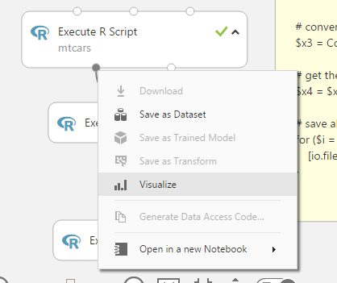
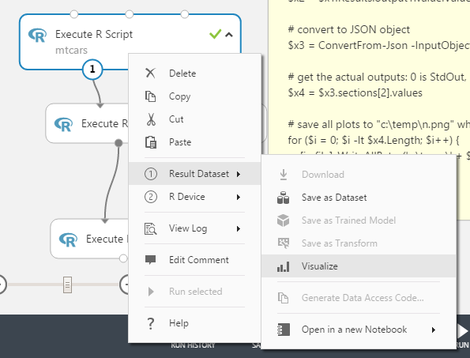
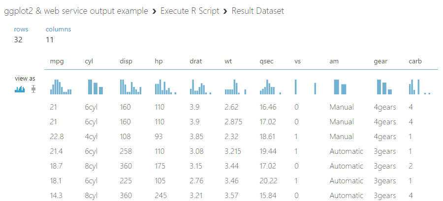
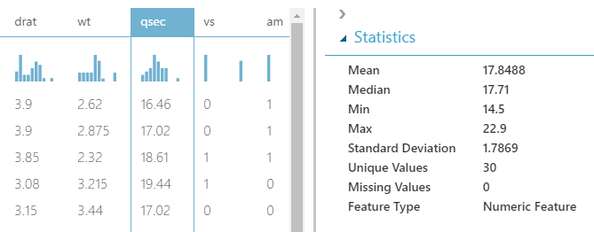
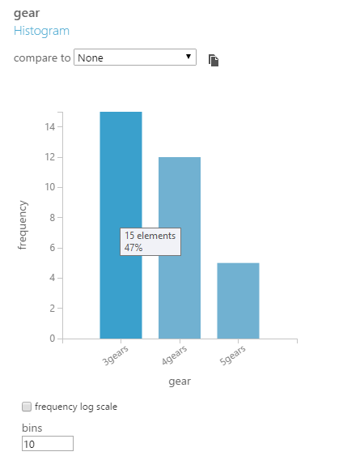
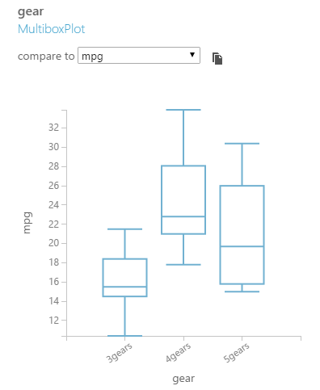
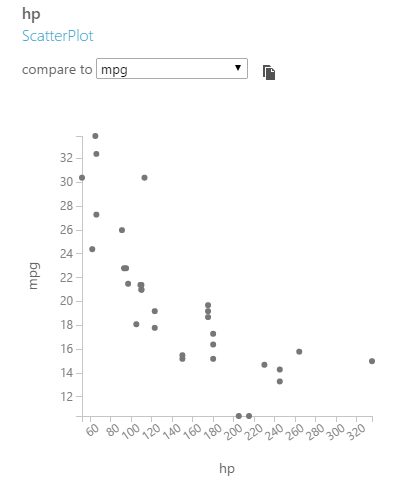
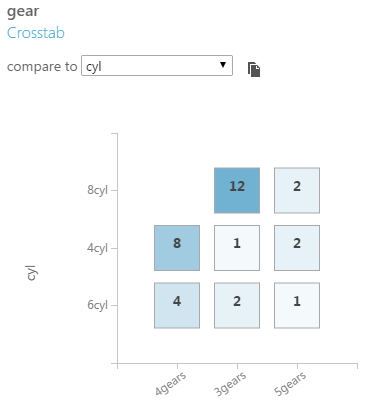
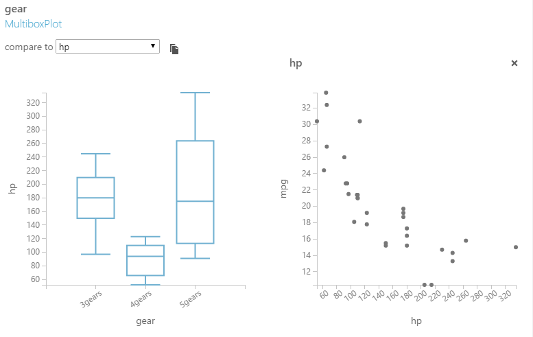

#Data Exploration in Azure Machine Learning Studio

Often times the first thing a data science practitioner does before building any ML models, is to explore the data and formulate intuitions on what can be done with the data. This kind of exploratory data analysis is essential to understand the characteristics of the data before building data models techniques or perform hypothesis testing.

Azure ML provides many ways to facilitate exploratory analysis out of the box. This article offers a quick tour of the common approaches. 

## Use the built-in _Visualize_ feature

One of the most popular features in Azure ML is the ability to visualize a dataset right in the experimente graph. Simply point the mouse at any output port, then click (either left-click or right-click; they both work the same way) on the port, and choose _Visualize_ on the output port context menu. 

You can also rigt-click on the module and the navigate through cascading menu which leads to the _Visualize_ menu item of the particular output port. 

The data visualization screen offers a convenient way to quickly understand the data visually. Below is an example using the [1974 Motor Trend Car Road Test data](https://stat.ethz.ch/R-manual/R-devel/library/datasets/html/mtcars.html) that comes with base R installation.

First of all, notice it shows the navigation breadcrumb that reminds you the name of the experiment, the name of the module and the name of the output port of the dataset that's being visualized currently. On the top right hand corner, it shows the number of rows and columns the current dataset has. It then displays a table containing data from the first 100 columns (starting from the left-most column) and the first 100 rows. Below the column name, it displays a mini histogram. By glancing on the mini histogram, you get a quick idea on the distribution of the data in that column. Numerical columns are automatically discretized into 10 bins to display the histogram. For string or categorical values, the histogram includes counts of the 10 most frequent values.

You can then select a column by clicking on the column header or any row of that column in the data table. On the right hand side, you get some basic statistics for the selected column. The first thing you should pay attention to, is the _Feature Type_ field. It displays the data type of the column (numerical, string or categorical), as well as additinal metadata that identifies the column a _feature_ column, a _label_ column, or a _weight_ column. This is signficant because many modules, expecially machine learning modules, apply specific logic to columns based on their metadata. For example, _Train Model_ module uses the column with _label_ metadata as training target; it takes all _feature_ columns, and ignores columns not marked as _feature_ columns; it also recognizes _weight_ column and applies weights for some linear algorithms. To mark column meta data, you can use the _Edit Metadata_ module.

For both numerical and string/categorical columns, number of _unique values_, number of _missing values_ are displayed.

Additionally for numerical columns, _mean_, _median_, _min_, _max_, _standard deviation_ are also computed and displayed.

Below statistics, you will also find graphs. If the dataset has more than 65k cells (even though you only see the first 100 rows of the first 100 columns), it only displays the same basic histogram as you find under the column header, except it is larger and more legible. Plus you can mouse hover a particular bar and get element count and percentage values. 

However, if you dataset has 65k cells or less, you have many more options for the visualization. For the default histogram, you can change the count to log scale, and you can define the number of bins. Two-variable charts are also supported. If you compare a numerical column to a numerical column, you get a scatter chart. If you compare a numerical column to a categorical column, you get a box chart, with each box representing a category, and the box shows min/max/quartiles/mean and outliers. 

If you compare a categorical column and another categorical column, you get a cross table displaying the total number of elements falling into each cross category. 

In addition, you can also pin a chart you like by clicking on the copy button next to the "Compare to" dropdown. And it will stay there even if you select a different column. This way you can easily compare 2 or more charts next to eather other.

## Use _Summarize Data_ module
Sometimes you'd like to see more summary statistics for each column than the defualt few showing in the Visualization screen. You can connect the dataset output to a _Summarize Data_ module. This module works very similarly as the _summary()_ function in R. It computes a lot of additional interesting statitics for numerical columns, including _1st and 3rd quartile_, _mode_, _range_, _sample variance_, _sample standard deviation_, _sample skewness_, _sample kurtosis_ and a bunch of _p values_.

## Use _Compute Elementary Statistics_ module.
If the summary statistics are not enough, you can also drag a _Compute Elementary Statistics_ module into the graph, connect the ouput dataset of a module to it, and compute additinal statistics. It allows you to select columns, default to all numerical columns, that you want to perform statistics computation on. And you can choose from a large array of statistics, such as _deviation squared_, _geometric mean_, _interquartile distance_ and etc.

## Use _Execute R or Python Script_ module
If the built-in visualization and computed statistics are not enough, or if your dataset has more than 100 columns and you just want to visualize a subset, it might be a good idea to use an Execute R/Python Script module. Following is an example of using the popular ggplot2 R package to visualize the _mtcars_ (1974 Motor Trend Car Road Test) dataset.

## Use _JuPyteR Notebook_ with R and Python kernels 
In addition, Azure ML also has built-in JuPyteR notebook support to explore and visualze data. The caveat is that you must be an owner of the current workspace in order to access notebook, and the dataset must be in CSV format. If your data is in the default "Dataset" format, you can easily convert it to CSV format by using a _Convert to CSV_ module. Then you can directly open the dataset in notebooking using a Python 2, Python 3 or R kernel. Following is an example of using the popular _matlibplot_ library in Python 2 to visualize the same _mtcars_ (1974 Motor Trend Car Road Test) dataset.
